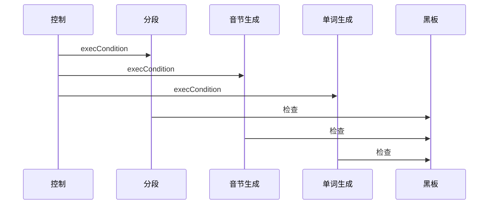

>Blackboard架构模式对还未找到确定解决策略的问题很有帮助。在Blackboard模式中，多个专业子系统通过集思广益，获得可能的部分解或近似解。
###背景
未找到或找不到确定解决之道的不成熟领域。
###问题
Blackboard模式解决没有可行而确定的解决方案将原始数据转换为高级数据结构(如图表或英语词组)。存在这种问题的领域包括视觉识别、图像识别、语音识别和监视等。这种问题具有如下特点：可分解成多个子问题，但每个子问题都属于不同的专业领域。
对于这种问题，影响其解决方案的作用力如下。
- 不可能在合理的时间内遍历整个解空间。
- 鉴于领域不成熟，可能需要对同一个子任务尝试不同的算法。
- 子问题的算法各不相同。
- 输入、中间结果和最终结果的表示方式各不相同，而不同算法是根据不同范式实现的。
- 一个算法通常使用另一个算法的结果。
- 涉及不可靠的数据和近似解。
- 算法的执行顺序不确定时还可能要求支持并行性。
###解决方案
Blackboard架构背后的理念是，一系列独立的程序携手合作，致力于处理同一个数据结构。
在解决问题的过程中，系统通过合并、修正或否决部分解来完成工作。每个部分解都针对一个子问题，是这个子问题的最终解在特定阶段的表现形式。所有的可能解构成解空间，并被组织成多个抽象层级，其中最低层为输入的内部表示，最高层包含系统要解决的整个问题的可能解。
之所以使用名称“黑板”(blackboard)，是因为它让人想起专家们站在黑板前协作解决问题的情形。专家们通常自行决定截下来该由谁来到黑板前，而在这里介绍的模式中，如果有多个程序都能提供帮助，将由调停者(moderator)组件决定这些程序的执行顺序。
###结构
对系统进行划分，使其包含一个黑板组件、一系列知识源以及一个控制组件。
黑板为中央数据存储区，解空间中的元素及控制数据都存储在这里。黑板提供了一个接口，让所有知识源都能够对其进行读写。
每个知识源都是一个独立的子系统，解决整个问题的特定方面。
控制组件运行一个监视黑板内容变化的循环，并决定接下来采取什么措施。
###实现

1. 定义问题。
2. 定义问题的解空间。我们将解分为中间解和顶级解，还将其分为部分解和完整解。顶级解位于最高抽象层级，其他层级的解为中间解。完整解是整个问题的答案，而部分解是部分问题的答案。
3. 将求解过程分为如下步骤：
- 定义如何将解转换为上一层级的解。
- 描绘如何作出同一抽象层级的推测。
- 详细说明如何从其他层级寻找证据，以证实做出的推测。
- 指出可利用什么样的知识将部分解空间排除在外。
4. 根据子任务将知识划分为专业知识源。
5. 定义黑板的词表。
6. 规范系统的控制机制。
7. 实现知识源。